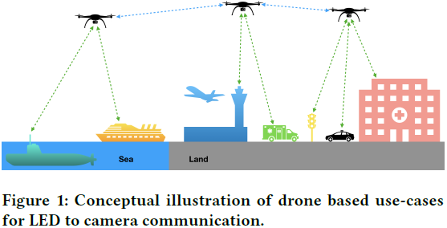

# 드론 LED-카메라 통신
## ABSTRACT
이 작업은 드론 통신에 LED 카메라 통신을 사용하는 아이디어를 탐구합니다. 
특히,이 연구는 지상과 드론 간, 드론 간 통신을 위해 LED 송신기와 카메라 / 이미지 센서 수신기를 사용하는 광 무선 링크를 사용하는 아이디어를 제시합니다.
이 개념은 무선 주파수 (RF) 무선에 대한 보완적인 가시선 (LOS) 기술에 대한 기회를 열어 드론 통신을 가능하게하는 동시에 드론 고유의 가혹한 모바일 설정에서 통신 할 수있는 능력에 대한 근본적인 연구 문제를 제기합니다.
이를 위해 본 논문에서는 다양한 모바일 설정 또는 드론의 궤적에서 지상 드론 통신을위한 LED 카메라 통신 성능에 대한 실증적 연구를 제시합니다.
비트 오류율 (BER) 메트릭 기반 성능 평가를 통해 실제 모바일 조건에서 드론 지상 업 링크 및 다운 링크 LED 통신의 품질을 평가합니다.
BER 평가의 통찰력을 통해 우리는 드론 가시광 통신 (VLC)의 실용성을 제한하는 해결해야 할 근본적인 문제를 강조합니다.  
  
## INTRODUCTION
드론으로 널리 알려진 무인 항공기 (UAV)는 IoT [1–3], 차세대 인프라 [4] 계획에서 필수적인 부분이되었습니다. 
이를 지원하는 통신 기술과 인프라의 발전으로 드론은 단순한 항공 감지 장치 이상으로 인식되고 있습니다. 
드론을 공중 기지국으로 사용하는 개념은 점점 더 탄력을 받고 있습니다. 
드론과 지상국 간의 통신은 안전에 중요한 것부터 통신 중계, 라스트 마일 연결 활성화에 이르기까지 다양한 애플리케이션에 매우 유용 할 수 있습니다. 
현재 드론 통신을위한 가장 인기있는 선택은 무선 주파수 (RF) [5, 6]를 사용하는 것입니다. 
그러나 도청 가능성, 해킹 경향, 무선 스펙트럼이 매우 복잡하다는 사실과 같은 RF 통신의 근본적인 문제는 드론 통신에 RF를 사용하는 데 중요한 문제를 제기합니다. 드론을위한 최고의 통신 매체를 선택하는 것은 분명한 질문이며, 어떤 RF에 대해 강력한 경쟁자이지만 핵심적인 한계가 있으므로 다른 방식을 탐색 할 필요가 있습니다.  
  

###### [fig 1] Conceptual illustration of drone based use-cases for LED to camera communication.
  
개념적으로, 드론-지상 및 드론-드론 통신 링크는 OTA (over-the-air) 매체를 사용하며, 이러한 링크는 일반적으로 대부분의 사용 사례 시나리오에서 신호 경로에 장애물 / 장애물이 없습니다 (그림 1 참조). 
대부분의 통신 시나리오에서 드론-그라운드 및 드론-드론 통신 링크는 가시선 (LOS) 채널을 통해 이루어 지므로 드론 통신에 LOS 통신 방식을 사용할 수있는 기회가 열립니다. 
이와 관련하여이 연구에서 우리는 발광 다이오드 (LED)를 송신기로 사용하고 이미지 센서 또는 카메라를 수신기로 사용하여 가시 광선 스펙트럼에서 광 무선 통신을 사용하는 방법을 탐구합니다. 
이는 문헌에서 LED- 카메라 통신이라고도합니다.  
  
저자의 이전 연구는 LED와 광 수신기를 사용하는 드론 [7]에서 가시광 통신 (VLC)을 사용하는 아이디어도 제시했습니다. 
VLC는 높은 데이터 용량, 조명 및 통신의 이중 사용과 같은 RF 통신에 비해 몇 가지 이점을 제공 할 수 있으며 눈에 띄지 않게 스니핑하여 링크 보안을 향상시키는 데 어려움을 겪습니다.
또한 드론은 거의 기본적으로 영상 캡처 또는 고급 시각 감지 / 컴퓨터 비전에 정기적으로 사용하기 위해 카메라를 장착 할 예정입니다. 
이것은 드론 카메라 통신을 가능하게하는 빌트인 인프라를 제공합니다.  
  
모바일 환경에서 LED- 카메라 통신을 가능하게하는 문제는 아직 해결되지 않은 열린 연구 문제이며 최근 연구의 초점이기도합니다. 
드론 통신은 관심 영역 / 객체 위를 떠 다니는 경우에도 제로 이동성 또는 정적 상태로 간주 될 수 없습니다 (논문 후반부에서 통신 성능에 미치는 영향). 
드론에서 광 무선 통신을 가능하게하는 것에 대한 조사는 제한적이며 [8] 이전 작업의 공통 전제는 드론 광 무선 링크의 가용성 (따라서 좋은 이해)입니다.  
  
10 년 넘게 VLC 기술을 개발하면서 얻은 경험과 학습이 드론 사용 사례에 적용될 수 있지만, 모바일 설정에서 강력한 VLC를 가능하게한다는 기본 개념이 핵심이며 실제로 드론 광 무선 통신의 기반입니다. 
이와 관련하여이 작업에서는 먼저 이동성 문제를 해결하는 드론 LED- 카메라 통신 방식을 탐색합니다. 
첫 번째 단계로 진행중인이 연구는 드론 이동성과 LED- 카메라 통신 품질에 미치는 영향을 연구합니다. 
실제 실험 기반 접근 방식을 통해이 작업은 BER (bit-error-rate)을 메트릭으로 사용하여 LED- 카메라 통신 품질의 경험적 평가를 제시합니다. 
요약하면이 백서의 기여는 다음과 같습니다.  
1. (i)에서 드론-지면 LED- 카메라 통신을위한 실험 설정 설계. 다운 링크 모드 (드론의 LED, 지상의 카메라) 및 (ii) 업 링크 모드 (지면의 LED, 드론의 카메라).  
2. 수직 운동, 호버링, 직선 운동, 원 운동, 이륙 및 착륙을 포함한 다양한 드론 이동 궤적에서 드론 LED- 카메라 통신의 실험적 평가. 평가는 통신 성능의 품질을 정량적으로 표현하고 비교하기위한 메트릭으로 BER을 사용합니다.  
  
## RELATED WORK
